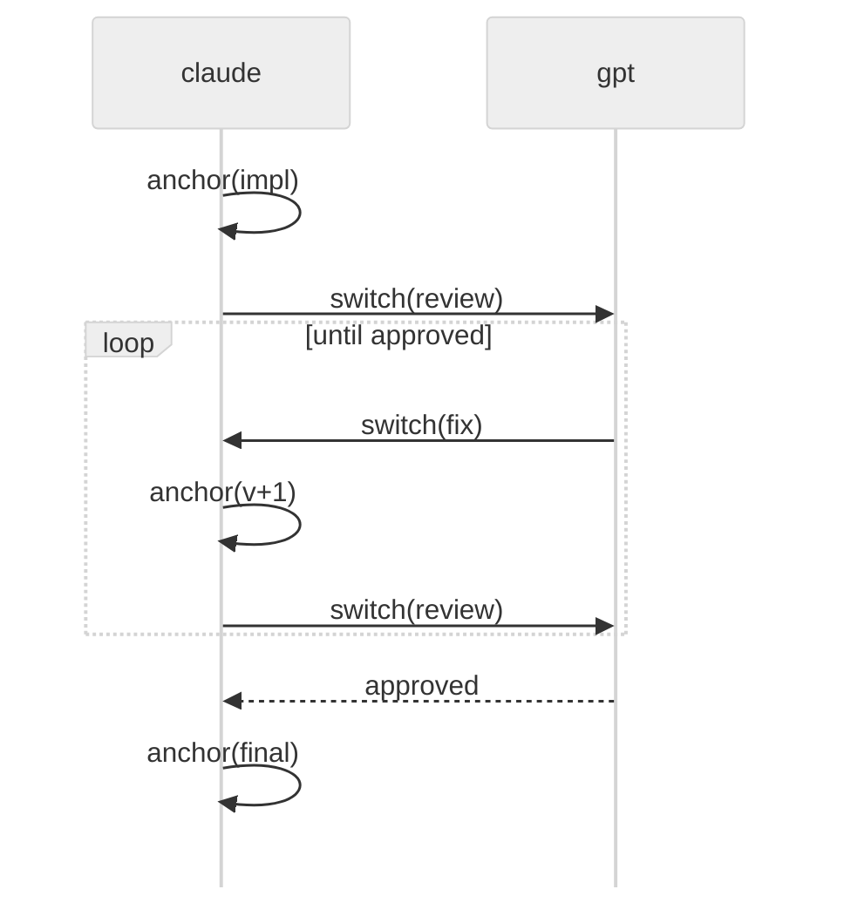

# pi-control

A [pi](https://pi.dev) package that lets the agent drive pi's runtime itself — resume sessions, switch models, navigate history, anchor and pivot — through tool calls.

Most agent harnesses keep these controls user-only. Ask for "my previous dev session" or "try another model from here", and the user still has to type the slash command. pi-control changes that: it patches pi's internal command context and exposes runtime control to the agent. **If the user can do it, the agent should too.**

## What's in the box

**Tools** (extension)

| Tool | Actions |
|---|---|
| `context` | `view`, `recall`, `anchor`, `pivot` |
| `sessions` | `info`, `search`, `resume`, `new`, `name`, `queue_message`, `reload` |
| `tree` | `list`, `search`, `labels`, `set_label`, `navigate`, `fork`, `compact` |
| `models` | `list`, `switch`, `consult` |

**Skill**

`context-management` — teaches the agent when and how to use these tools: anchor at task boundaries, pivot before changing direction, recall prior sessions, hand off to a different model for review.

**Status line**

```
[pi-control] model=<provider/id> | context=<n>% | tool=<n>% | anchor=<name> (-<dist>)
```

`tool=` is the share of active context occupied by tool results. `anchor=` shows the most recent anchor and how many entries back it lives.

## Example: cross-model review loop



The whole loop ran through tool calls — no slash commands.

## Install

```bash
pi install git:github.com/tshu-w/pi-control
```

## Heads-up: private API hack

To drive `resume` / `new` / `navigate` / `fork` / `pivot` from tool calls, pi-control patches `ExtensionRunner.prototype.bindCommandContext` at runtime — pi does not yet expose these as public APIs.

The patch is idempotent and applied once on activation. If it fails (pi internal drift, version mismatch), the affected actions fall back to printing the equivalent slash command and the rest of the tool surface keeps working. Compatibility is therefore tighter than a normal extension; tested against `@earendil-works/pi-coding-agent` 0.74.x.

When pi adds first-class APIs, the hack goes away.

## License

MIT.
